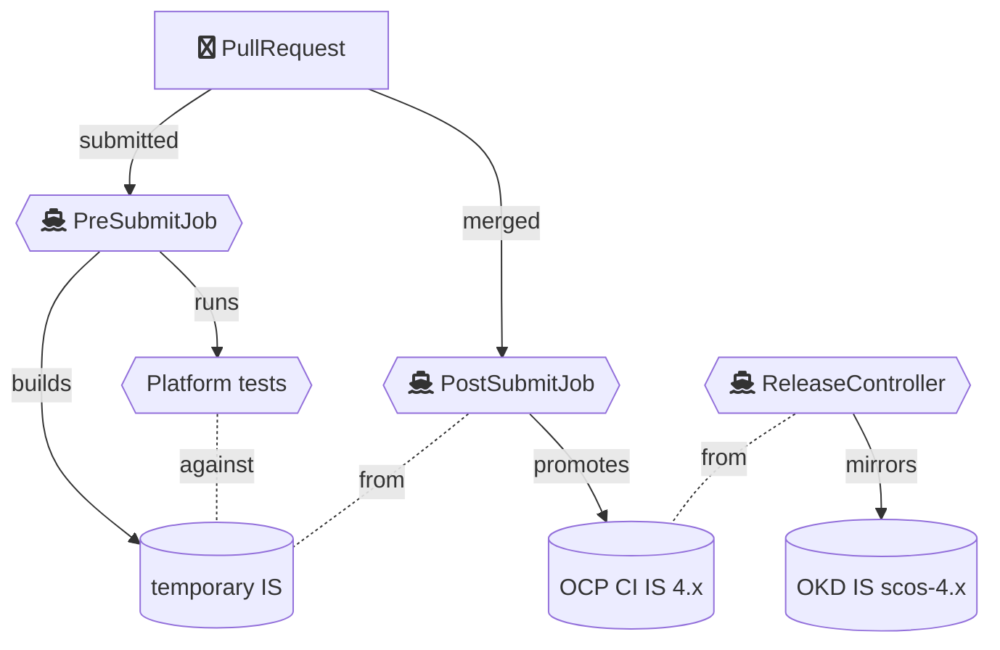
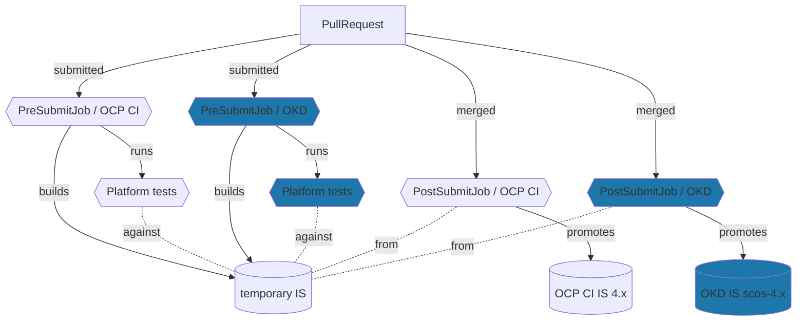
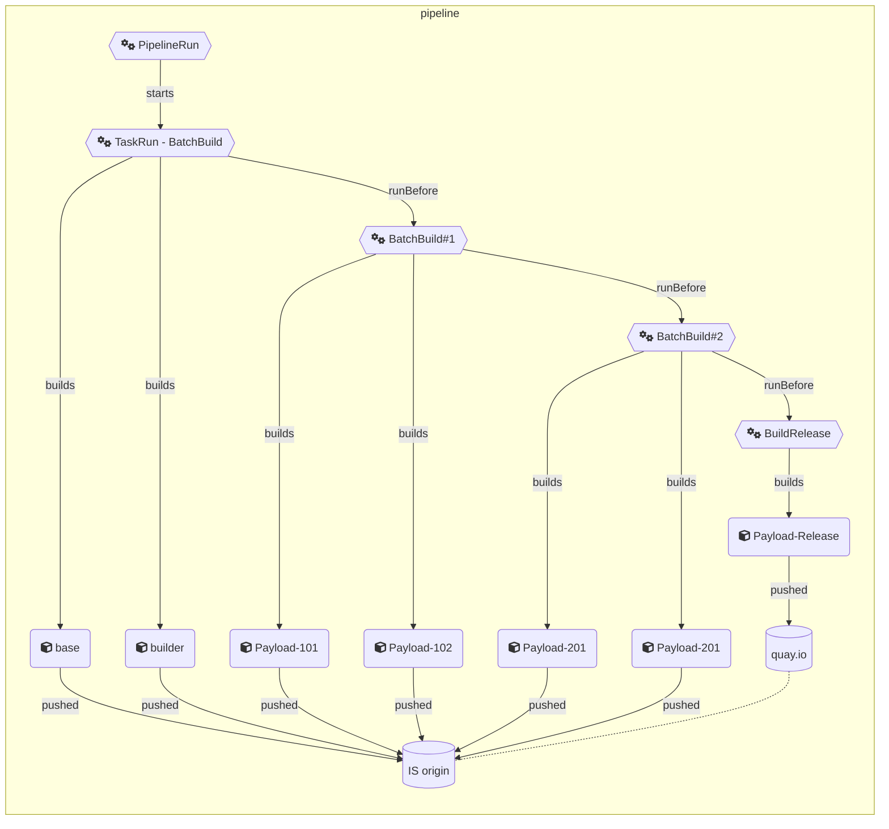

# Building the OKD payload

<!--- cSpell:ignore SCOS buildconfigs buildconfig Kustomize kustomization baremetal -->

Over the last couple of months, we've been busy building a new OKD release on [CentOS Stream](https://www.centos.org/centos-stream/) [CoreOS](https://en.wikipedia.org/wiki/Container_Linux) (SCOS), and were able to present it for the [OpenShift Commons Detroit 2022](./10-20-OKD-at-Kubecon-NA-Detroit.md).  

<!-- more -->

While some of us created a Tekton pipeline that could [build SCOS](https://www.youtube.com/watch?v=HcGsvSms--A&list=PLaR6Rq6Z4Iqck7Z0ekuJdsMU1fE6hkd6d&index=2) on a Kind cluster, others were tediously building the OKD payload with Prow, but also creating a [Tekton](https://tekton.dev/) pipeline for building that payload on any OpenShift or OKD cluster.

The goal of this effort is to enable and facilitate community collaboration and contributions, giving anybody the ability to do their own payload builds and run tests themselves.

This process has been difficult because OpenShift's Prow CI instance is not open to the public, and changes could thus not easily be tested before PR submission. Even after opening a PR, a non-Red Hatter will require a Red Hat engineer to add the `/ok-to-test` label in order to start Prow testing.

With the new Tekton pipelines, we are now providing a straight forward way for anybody to build and test their own changes first (or even create their own Stream entirely), and then present the results to the OKD Working Group, which will then expedite the review process on the PR.

In this article, I will shed some light on the building blocks of the OKD on SCOS payload, how it is built, both the Prow way, and the Tekton way:  

## What's the payload?

Until now, the OKD payload, like the OpenShift payload, was built by the [ReleaseController](https://github.com/openshift/release/tree/master/core-services/release-controller) in Prow.

> The release-controller automatically builds OpenShift release images when new images are created for a given OpenShift release. It detects changes to an image stream, launches a job to build and push the release payload image using `oc adm release new`, and then runs zero or more ProwJobs against the artifacts generated by the payload.

A release image is nothing more than a ClusterVersionOperator image (CVO), with an extra layer containing the `release-manifests` folder. This folder contains :

- `image-references`: a list of all known images with their SHA digest,
- yaml manifest files for each operator controlled by the CVO.

The list of images that is included in the `release-manifests` is calculated from the `release` [image stream](https://developers.redhat.com/blog/2019/09/20/using-red-hat-openshift-image-streams-with-kubernetes-deployments#), taking :

- all images with label `io.openshift.release.operator=true` in that image stream
- plus any images referenced in the `/manifests/image-references` file within each of the images with this label.

As you can imagine, the list of images in a release can change from one release to the next, depending on:

- new operators being delivered within the OpenShift release
- existing operators adding or removing an operand image
- operators previously included that are removed from the payload to be delivered independently, through OLM instead.

In order to list the images contained in a release payload, run this command:

```shell
oc adm release info ${RELEASE_IMAGE_URL}
```

For example:

```shell
oc adm release info quay.io/okd/scos-release:4.12.0-0.okd-scos-2022-12-02-083740 
```

Now that we've established what needs to be built, let's take a deeper look at how the OKD on SCOS payload is built.

## Building OKD/SCOS the Prow way

The obvious way to build OKD on SCOS is to use [Prow](https://docs.prow.k8s.io/docs/) - THE Kubernetes-based CI/CD system, which is what builds OCP and OKD on FCOS already today. This is what Kubernetes uses upstream as well. :shrug:

For a new OKD release to land in the [releases](https://origin-release.ci.openshift.org) page, there's a whole bunch of Prow jobs that run. Hang on! It's a long story...

### ImageStreams

Let's start by the end :wink:, and prepare a new image stream for OKD on SCOS images. This ImageStream (IS) is a placeholder for all images that form the OKD/SCOS payload.

For OKD on Fedora CoreOS (OKD/FCOS) it's named `okd`.For OKD/SCOS, this ImageStream is named `okd-scos`.  

This ImageStream includes all payload images contained in the specific `OKD` release based on CentOS Stream CoreOS (SCOS)  

Among these payload images, we distinguish:

- Images that can be shared between OCP and OKD. These are built in Prow and mirrored into the `okd-scos` ImageStream.  
- Images that have to be specifically built for OKD/SCOS, which are directly tagged into the `okd-scos` ImageStream. This is the case for images that are specific to the underlying operating system, or contain RHEL packages. These are: the `installer` images, the `machine-config-operator` image, the `machine-os-content` that includes the base operating system OSTree, as well as the `ironic` image for provisioning bare-metal nodes, and a few other images.

### Triggers for building most payload images

Now that we've got the recipient Image Stream for the OKD payload images, let's start building some payloads!  

Take the [Cluster Network Operator](https://github.com/openshift/cluster-network-operator) for example:  
For this operator, the same image can be used on OCP CI and OKD releases. Most payload images fit into this case.  

For such an image, the build is pretty straight forward. When a PR is filed for a GitHub repository that is part of a release payload:

- The Pre-submit jobs run. It essentially builds the image and stores it in an ImageStream in an ephemeral namespace to run tests against several platforms (AWS, GCP, BareMetal, Azure, etc)
- Once the tests are green and the PR is approved and merges, the Post-submit jobs run. It essentially promotes the built image to the appropriate release-specific ImageStream:

    - if the PR is for master, images are pushed to the `${next-release}` ImageStream
    - If the PR is for `release-${MAJOR}.${MINOR}`, images are pushed to the `${MAJOR}.${MINOR}` ImageStream

Next, the [OCP release controller](https://github.com/openshift/release/blob/master/core-services/release-controller/_releases/release-ocp-4.13-ci.json#L12) which runs at every change to the ImageStream, will mirror all images from the `${MAJOR}.${MINOR}` ImageStream to the `scos-${MAJOR}.${MINOR}` ImageStream.



As mentioned before, some of the images are not mirrored, and that brings us to the next section, on building those images that have content (whether code or manifests) specific to OKD.

### Trigger for building the OKD-specific payload images

For the OKD-specific images, the CI process is a bit different, as the image is built in the PostSubmit job and then directly promoted to the `okd-scos` IS, without going through the OCP CI to OKD mirroring step.
This is called [a variant configuration](https://docs.ci.openshift.org/docs/how-tos/contributing-openshift-release/#variants). You can see this for [MachineConfigOperator](https://github.com/openshift/release/blob/master/ci-operator/config/openshift/machine-config-operator/openshift-machine-config-operator-master__okd-scos.yaml) for example.  



The built images land directly in the `scos-${MAJOR}-${MINOR}` ImageStream.

That is why there's no need for OCP's CI release controller to mirror these images from the CI ImageStream:
During the PostSubmit phase, images are already getting built in parallel for OCP, OKD/FCOS and OKD/SCOS and pushed, respectively to `ocp/$MAJOR.$MINOR`, `origin/$MAJOR.$MINOR`, `origin/scos-$MAJOR.$MINOR`

### OKD release builds

Now the ImageStream `scos-$MAJOR.$MINOR` is getting populated by payload images. With every new image tag, the [release controller for OKD/SCOS](https://github.com/openshift/release/blob/master/core-services/release-controller/_releases/release-okd-scos-4.13.json) will  build a release image.

The ReleaseController ensures that OpenShift update payload images (aka release images) are created whenever an ImageStream representing the images in a release is updated.  

Thanks to the annotation `release.openshift.io/config` on the `scos-${MAJOR}-{MINOR}` ImageStream, the controller will:

1. Create a tag in the `scos-${MAJOR}-{MINOR}` ImageStream that uses the release name + current timestamp.
2. Mirror all of the tags in the input ImageStream so that they can't be pruned.
3. Launch a job in the job namespace to invoke `oc adm release new` from the mirror pointing to the release tag we created in step 1.
4. If the job succeeds in pushing the tag, it sets an annotation on that tag `release.openshift.io/phase = "Ready"`, indicating that the release can be used by other steps. And that's how a new release appears in [`https://origin-release.ci.openshift.org/#4.13.0-0.okd-scos](https://origin-release.ci.openshift.org/#4.13.0-0.okd-scos)
5. The release state switches to "Verified" when the [verification end-to-end test job](https://github.com/openshift/release/blob/master/core-services/release-controller/_releases/release-okd-scos-4.13.json#L20)  succeeds.

## Building the Tekton way

Building with Prow has the advantage of being driven by new code being pushed to payload components, thus building fresh releases as the code of [github.com/openshift](https://github.com/openshift) evolves.

The problem is that Prow, along with all the clusters involved with it, the ImageStreams, etc. are not accessible to the OKD community outside of RedHat. Also, users might be interested in building custom OKD payload, in their own environment, to experiment exchanging components for example.

To remove this impediment, the OKD team has been working on the OKD Payload pipeline based on Tekton.

Building OKD payloads with Tekton can be done by cloning the [okd-payload-pipeline repository](https://github.com/okd-project/okd-payload-pipeline). One extra advantage of this repository is the ability to see the list of components that form the OKD payload: In fact, the list under [buildconfigs](https://github.com/okd-project/okd-payload-pipeline/tree/main/buildconfigs) corresponds to the images in the OKD final payload. This list is currently manually synced with the list of OCP images on each release.  

The pipeline is fairly simple. Take the [build-from-scratch.yaml](https://github.com/okd-project/okd-payload-pipeline/blob/main/pipelines/build-from-scratch.yaml) for example. It has 3 main tasks:

- Build the base image and the builder image, with which all the payload images will be built
    - The builder image is a CentOS Stream 9 container image that includes all the dependencies needed to build payload components and is used as the build environment for them
    - The built binaries are then layered onto a CentOS Stream 9 base image, creating a payload component image.
    - The base image is shared across all the images in the release payload
- Build payload images in batches (starting with the ones that don't have any dependencies)
- Finally, as all OKD payload component images are in the image stream, the OKD release image is in turn built, using the `oc adm release new` command.



### Triggers

For the moment, this pipeline has no triggers. It can be executed manually when needed. We are planning to automatically trigger the pipeline on a daily cadence.

### Batch Build Task

With a set of buildConfigs passed in the parameters, this task relies on an openshift `oc` image containing the client binary and loops on the list of build configs with a `oc start-build`, and waits for all the builds to complete.  

### New Release Task

This task simply uses an OpenShift client image to call `oc adm release new` which creates the release image from the image stream `release` (on the OKD/OpenShift cluster where this Tekton pipeline is running), and mirroring the release image, and all the payload component images to a registry configured in its parameters.  

### BuildConfigs

As explained above, the OKD payload Tekton pipeline heavily relies on the [buildconfigs](https://github.com/okd-project/okd-payload-pipeline/tree/main/buildconfigs).
This folder contains one buildconfig yaml file for each image included in the release payload.  

Each build config simply uses a builder image to build the operator binary, invoking the correct Dockerfile in the operator repository. Then, the binary is copied as a layer on top of an OKD base image, which is built in the preparatory task of the pipeline.  

This process currently uses the [OpenShift Builds API](https://docs.okd.io/4.11/cicd/builds/understanding-image-builds.html). We are planning to move these builds to the [Shipwright](https://shipwright.io/) Builds API in order to enable builds outside of OCP or OKD clusters.

### Updating build configs

Upon deploying the Tekton OKD Payload pipeline on an OKD (or OpenShift) cluster, Kustomize is used in order to :

- patch the BuildConfig files, adding TAGS to the build arguments according to the type of payload we want to build (based on FCOS, SCOS or any other custom stream)
- patch the BuildConfig files, replacing the builder image references to the non-public `registry.ci.openshift.org/ocp/builder` in the payload component's Dockerfiles with the builder image reference from the local image stream
- setting resource requests and limits if needed

### Preparing for a new release

The procedure to prepare a new release is still a work in progress at the time of writing.

To build a new release, each BuildConfig file should be updated with the git branch corresponding to that release.  
In the future, the branch can be passed along as a kustomization, or in the parameters of the pipeline.  

The list of images from a new OCP release (obtained through `oc adm release info`) must now be synced with the BuildConfigs present here:

- For any new image, a new BuildConfig file must be added
- For any image removed from the OCP release, the corresponding BuildConfig file must be removed.

## Take away

### What are our next steps?

In the coming weeks and months, you can expect lots of changes, especially as the OKD community is picking up usage of OKD/SCOS, and doing their own Tekton Pipeline runs:

- Work to automate the OKD release procedure is progress by automatically verifying payload image signatures, signing the release, and tagging it on GitHub.

The goal is to deliver a new OKD/SCOS on a sprint (3-weekly) basis, and to provide both the OCP teams and the OKD community with a fresh release to test much earlier than previously with the OCP release cadence.

- For the moment, OKD/SCOS releases are only verified on AWS. To gain more confidence in our release payloads, we will expand the test matrix to other platforms such as GCP, vSphere and Baremetal
- Enable GitOps on the Tekton pipeline repository, so that changes to the pipeline are automatically deployed on [OperateFirst](https://www.operate-first.cloud/) for the community to use the latest and greatest.
- The OKD Working Group will be collaborating with the [Mass Open Cloud](https://massopen.cloud/) to allow for deployments of test clusters on their baremetal infrastructure.
- The OKD Working Group will be publishing the Tekton Tasks and Pipelines used to build the SCOS Operating System as well as the OKD payload to [Tekton Hub](https://hub.tekton.dev/) and [Artifact Hub](https://artifacthub.io/)
- The [OKD operators Tekton pipeline](https://github.com/okd-project/okd-operator-pipeline/) will be used for community builds of optional OLM operators. A first OKD operator has already been built with it, and other operators are to follow, starting with the Pipelines operator, which has long been an ask by the community
- Additionally, we are working on multi-arch releases for both OKD/SCOS and OKD/FCOS

### Opened perspectives

Although in the near future the OKD team will still rely on Prow to build the payload images, the Tekton pipeline will start getting used to finalize the release.

In addition, this Tekton pipeline has opened up new perspectives, even for OCP teams.

One such example is for the [Openshift API team](https://github.com/openshift/api) who would like to use the Tekton pipeline to test API changes by building all components that are dependent of the OpenShift API from that PR, create an OKD release and test it thus getting extra quick feedback on impacts of the API changes on the OKD (and later OCP) releases.

Another example is the possibility to build images on other platforms than Openshift or OKD platform, replacing build configs with Shipwright, or why not `docker build`...

Whatever your favorite flavor is, we are looking forward to seeing the pipelines in action, increasing collaboration and improving our community feedback loop.
