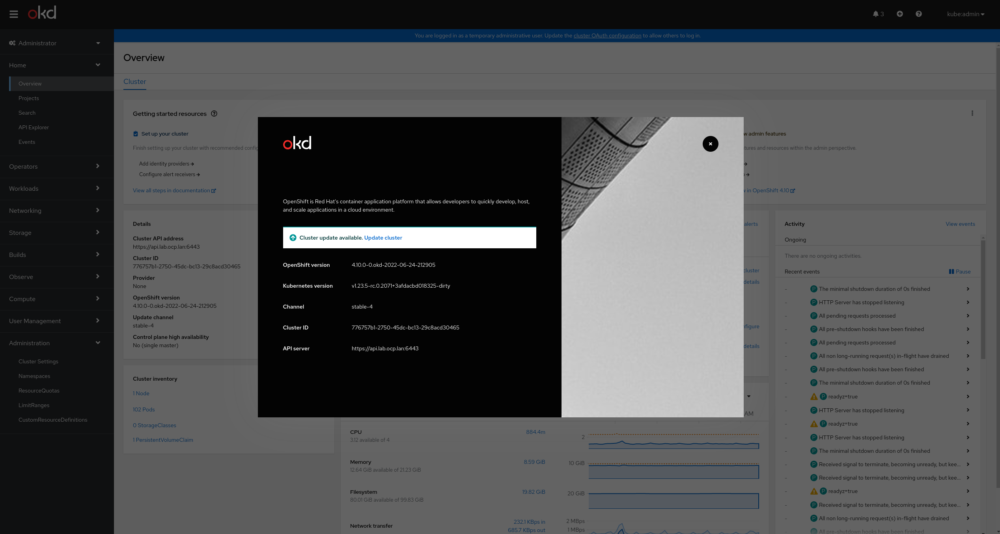

# Single Node UPI OKD Installation

<!--- cSpell:ignore wildcard virt libguestfs epel devel VM's vm's ryzen dnsmasq mastersSchedulable virsh schedulable -->

This document outlines how to deploy a single node (the real hard way) using UPI OKD cluster on bare metal or virtual machines.

<!-- more -->

## Overview

User provisioned infrastructure **(UPI)** of OKD 4.x Single Node cluster on bare metal or virtual machines

**N.B.** Installer provisioned infrastructure **(IPI)** - this is the preferred method as it is much simpler,  
it automatically provisions and maintains the install for you, however it is targeted towards cloud and on prem services  
i.e aws, gcp, azure, also for openstack, IBM, and vSphere. 

If your install falls in these supported options then use IPI, if not this means that you will more than likely have to fallback on the UPI install method.

At the end of this document I have supplied a link to my repository. It includes some useful scripts and an example install-config.yaml

## Requirements
The base installation should have 7 VM's (for a full production setup) but for our home lab SNO 
we will use 2 VM's (one for bootstrap and one for the master/worker node) with the following specs :

* Master/Worker Node/s
    * CPU: 4 core
    * RAM: 32G 
    * HDD: 50GB 

* Bootstrap Node
    * CPU: 4 core
    * RAM: 8G
    * HDD: 50G

**N.B.** - firewall services are disabled for this installation process

## Architecture (this refers to a full high availability cluster)

The diagram below shows an install for high availability scalable solution.
For our single node install we only need a **bootstrap** node and a **master/worker** node (2 bare metal servers or 2 VM's)

<!--{width=100%} comment for docusaurus compat-->


## Software

For the UPI SNO I made use of FCOS (Fedora CoreOS)

FCOS

* For OKD  https://getfedora.org/en/coreos/download?tab=metal_virtualized&stream=stable&arch=x86_64
    * Download the ISO image
    * Download the raw.tar.gz

OC Client & Installer

* From https://github.com/openshift/okd/releases
    * Download Openshift installer
    * Download Openshift client (cli)


## Procedure

The following is a manual process of installing and configuring the infrastructure needed. 

* HAProxy
* DNS (dnsmasq)
* NFS
* Config for ocp install etc

### Provision VM's (Optional) - Skip this step if you using bare metal servers

The use of VM's is optional, each node could be a bare metal server.
As I did not have several servers at my disposal I used a NUC (ryzen9 with 32G of RAM) and created 2 VM's (bootstrap and master/worker)

I used cockpit (fedora) to validate the network and vm setup (from the scripts). Use the virtualization software that you prefer.
For the okd-svc machine I used the bare metal server and installed fedora 37 (this hosted my 2 VM's)

The bootstrap server can be shutdown once the master/worker has been fully setup

Install virtualization

```bash 

sudo dnf install @virtualization
```

### Setup IP's and MAC addresses

Refer to the “Architecture Diagram” above to setup each VM

Obviously the IP addresses will change according to you preferred setup (i.e 192.168.122.x)
I have listed all servers, as it will be fairly easy to change the single node cluster to a fully fledged HA cluster, by changing the install-config.yaml

As a useful example this is what I setup

* Gateway/Helper : okd-svc 192.168.122.1
* Bootstrap : okd-bootstrap 192.168.122.253
* Control Plane 1 : okd-cp-1 192.168.122.2
* Control Plane 2 : okd-cp-2 192.168.122.3
* Control Plane 3: okd-cp-3 192.168.122.4
* Worker 1 : okd-w-1 192.168.122.5
* Worker 2: okd-w-2  192.168.122.6
* Worker 3: okd-w-3  192.168.122.7

Hard code MAC addresses (I created a text file to include in the VM network setting)

```bash
MAC: 52:54:00:3f:de:37, IP: 192.168.122.253
MAC: 52:54:00:f5:9d:d4, IP: 192.168.122.2
MAC: 52:54:00:70:b9:af, IP: 192.168.122.3
MAC: 52:54:00:fd:6a:ca, IP: 192.168.122.4
MAC: 52:54:00:bc:56:ff, IP: 192.168.122.5
MAC: 52:54:00:4f:06:97, IP: 192.168.122.6
```

### Install & Configure Dependency Software

#### Install & configure Apache Web Server

```
dnf install httpd -y
```

Change default listen port to 8080 in httpd.conf

```
sed -i 's/Listen 80/Listen 0.0.0.0:8080/' /etc/httpd/conf/httpd.conf
```

Enable and start the service

```
 systemctl enable httpd
 systemctl start httpd
 systemctl status httpd
```

Making a GET request to localhost on port 8080 should now return the default Apache webpage

```
curl localhost:8080
```


#### Install HAProxy and update the haproxy.cfg as follows

```
dnf install haproxy -y
```

Copy HAProxy config

```
cp ~/openshift-vm-install/haproxy.cfg /etc/haproxy/haproxy.cfg
```

Update Config

```bash
# Global settings
#---------------------------------------------------------------------
global
	maxconn 	20000
	log     	/dev/log local0 info
	chroot  	/var/lib/haproxy
	pidfile 	/var/run/haproxy.pid
	user    	haproxy
	group   	haproxy
	daemon

	# turn on stats unix socket
	stats socket /var/lib/haproxy/stats

#---------------------------------------------------------------------
# common defaults that all the 'listen' and 'backend' sections will
# use if not designated in their block
#---------------------------------------------------------------------
defaults
	log                 	global
	mode                	http
	option              	httplog
	option              	dontlognull
	option http-server-close
	option redispatch
	option forwardfor   	except 127.0.0.0/8
	retries             	3
	maxconn             	20000
	timeout http-request	10000ms
	timeout http-keep-alive 10000ms
	timeout check       	10000ms
	timeout connect     	40000ms
	timeout client      	300000ms
	timeout server      	300000ms
	timeout queue       	50000ms

# Enable HAProxy stats
listen stats
	bind :9000
	stats uri /stats
	stats refresh 10000ms

# Kube API Server
frontend k8s_api_frontend
	bind :6443
	default_backend k8s_api_backend
	mode tcp

backend k8s_api_backend
	mode tcp
	balance source
	server  	bootstrap 192.168.122.253:6443 check
	server  	okd-cp-1 192.168.122.2:6443 check
	server  	okd-cp-2 192.168.122.3:6443 check
	server  	okd-cp-3 192.168.122.4:6443 check

# OCP Machine Config Server
frontend ocp_machine_config_server_frontend
	mode tcp
	bind :22623
	default_backend ocp_machine_config_server_backend

backend ocp_machine_config_server_backend
	mode tcp
	balance source
	server  	bootstrap 192.168.122.253:22623 check
	server  	okd-cp-1 192.168.122.2:22623 check
	server  	okd-cp-2 192.168.122.3:22623 check
	server  	okd-cp-3 192.168.122.4:22623 check

# OCP Ingress - layer 4 tcp mode for each. Ingress Controller will handle layer 7.
frontend ocp_http_ingress_frontend
	bind :80
	default_backend ocp_http_ingress_backend
	mode tcp

backend ocp_http_ingress_backend
	balance source
	mode tcp
	server  	okd-cp-1 192.168.122.2:80 check
	server  	okd-cp-2 192.168.122.3:80 check
	server  	okd-cp-3 192.168.122.4:80 check
	server  	okd-w-1 192.168.122.5:80 check
	server  	okd-w-2 192.168.122.6:80 check

frontend ocp_https_ingress_frontend
	bind *:443
	default_backend ocp_https_ingress_backend
	mode tcp

backend ocp_https_ingress_backend
	mode tcp
	balance source
	server  	okd-cp-1 192.168.122.2:443 check
	server  	okd-cp-2 192.168.122.3:443 check
	server  	okd-cp-3 192.168.122.4:443 check
	server  	okd-w-1 192.168.122.5:443 check
	server  	okd-w-2 192.168.122.6:443 check
```

Start the HAProxy service

```
sudo systemctl start haproxy
```


Install dnsmasq and set the dnsmasq.conf file as follows

```bash
# Configuration file for dnsmasq.

port=53

# The following two options make you a better netizen, since they
# tell dnsmasq to filter out queries which the public DNS cannot
# answer, and which load the servers (especially the root servers)
# unnecessarily. If you have a dial-on-demand link they also stop
# these requests from bringing up the link unnecessarily.

# Never forward plain names (without a dot or domain part)
#domain-needed
# Never forward addresses in the non-routed address spaces.
bogus-priv

no-poll

user=dnsmasq
group=dnsmasq

bind-interfaces

no-hosts
# Include all files in /etc/dnsmasq.d except RPM backup files
conf-dir=/etc/dnsmasq.d,.rpmnew,.rpmsave,.rpmorig

# If a DHCP client claims that its name is "wpad", ignore that.
# This fixes a security hole. see CERT Vulnerability VU#598349
#dhcp-name-match=set:wpad-ignore,wpad
#dhcp-ignore-names=tag:wpad-ignore


interface=eno1
domain=okd.lan

expand-hosts

address=/bootstrap.lab.okd.lan/192.168.122.253
host-record=bootstrap.lab.okd.lan,192.168.122.253

address=/okd-cp-1.lab.okd.lan/192.168.122.2
host-record=okd-cp-1.lab.okd.lan,192.168.122.2

address=/okd-cp-2.lab.okd.lan/192.168.122.3
host-record=okd-cp-2.lab.okd.lan,192.168.122.3

address=/okd-cp-3.lab.okd.lan/192.168.122.4
host-record=okd-cp-3.lab.okd.lan,192.168.122.4

address=/okd-w-1.lab.okd.lan/192.168.122.5
host-record=okd-w-1.lab.okd.lan,192.168.122.5

address=/okd-w-2.lab.okd.lan/192.168.122.6
host-record=okd-w-2.lab.okd.lan,192.168.122.6

address=/okd-w-3.lab.okd.lan/192.168.122.7
host-record=okd-w-3.lab.okd.lan,192.168.122.7

address=/api.lab.okd.lan/192.168.122.1
host-record=api.lab.okd.lan,192.168.122.1
address=/api-int.lab.okd.lan/192.168.122.1
host-record=api-int.lab.okd.lan,192.168.122.1

address=/etcd-0.lab.okd.lan/192.168.122.2
address=/etcd-1.lab.okd.lan/192.168.122.3
address=/etcd-2.lab.okd.lan/192.168.122.4
address=/.apps.lab.okd.lan/192.168.122.1

srv-host=_etcd-server-ssl._tcp,etcd-0.lab.okd.lan,2380
srv-host=_etcd-server-ssl._tcp,etcd-1.lab.okd.lan,2380
srv-host=_etcd-server-ssl._tcp,etcd-2.lab.okd.lan,2380

address=/oauth-openshift.apps.lab.okd.lan/192.168.122.1
address=/console-openshift-console.apps.lab.okd.lan/192.168.122.1
```

Start the dnsmasq service 

```
sudo /usr/sbin/dnsmasq --conf-file=/etc/dnsmasq.conf
```

Test that your DNS setup is working correctly

**N.B.**  It's important to verify that dns works, I found that for example if api-int.lab.okd.lan didn’t resolve (also with reverse lookup) I had problems with bootstrap failing.

```bash
# test & results
$ dig +noall +answer @192.168.122.1 api.lab.okd.lan
api.lab.okd.lan.    0    IN    A    192.168.122.1

$ dig +noall +answer @192.168.122.1 api-int.lab.okd.lan
api-int.lab.okd.lan.    0    IN    A    192.168.122.1

$ dig +noall +answer @192.168.122.1 random.apps.lab.okd.lan
random.apps.lab.okd.lan. 0    IN    A    192.168.122.1

$ dig +noall +answer @192.168.122.1 console-openshift-console.apps.lab.okd.lan
console-openshift-console.apps.lab.okd.lan. 0 IN A 192.168.122.1

$ dig +noall +answer @192.168.122.1 okd-bootstrap.lab.okd.lan
okd-bootstrap.lab.okd.lan. 0    IN    A    192.168.122.253

$ dig +noall +answer @192.168.122.1 okd-cp1.lab.okd.lan
okd-cp1.lab.okd.lan.    0    IN    A    192.168.122.2

$ dig +noall +answer @192.168.122.1 okd-cp2.lab.okd.lan
okd-cp2.lab.okd.lan.    0    IN    A    192.168.122.3


$ dig +noall +answer @192.168.122.1 okd-cp3.lab.okd.lan
okd-cp3.lab.okd.lan.    0    IN    A    192.168.122.4

$ dig +noall +answer @192.168.122.1 -x 192.168.122.1
1.122.168.192.in-addr.arpa. 0    IN    PTR    okd-svc.okd-dev.

$ dig +noall +answer @192.168.122.1 -x 192.168.122.2
2.122.168.192.in-addr.arpa. 0    IN    PTR    okd-cp1.lab.okd.lan.

$ dig +noall +answer @192.168.122.1 -x 192.168.122.3
3.122.168.192.in-addr.arpa. 0    IN    PTR    okd-cp2.lab.okd.lan.

$ dig +noall +answer @192.168.122.1 -x 192.168.122.4
4.122.168.192.in-addr.arpa. 0    IN    PTR    okd-cp3.lab.okd.lan.

$ dig +noall +answer @192.168.122.1 -x 192.168.122.5
5.122.168.192.in-addr.arpa. 0    IN    PTR    okd-w1.lab.okd.lan.

$ dig +noall +answer @192.168.122.1 -x 192.168.122.6
6.122.168.192.in-addr.arpa. 0    IN    PTR    okd-w2.lab.okd.lan.

$ dig +noall +answer @192.168.122.1 -x 192.168.122.7
7.122.168.192.in-addr.arpa. 0    IN    PTR    okd-w3.lab.okd.lan.
```

Install and configure NFS for the OKD Registry. It is a requirement to provide storage for the Registry, emptyDir can be specified if necessary.

```
sudo dnf install nfs-utils -y
```
   
Create the share
   
```
mkdir -p /shares/registry
chown -R nobody:nobody /shares/registry
chmod -R 777 /shares/registry
```

Export the share, this allows any service in the 192.168.122.xxx range to access NFS

```
echo "/shares/registry  192.168.122.0/24(rw,sync,root_squash,no_subtree_check,no_wdelay)" > /etc/exports

exportfs -rv
```
  
Enable and start the NFS related services

```bash
sudo systemctl enable nfs-server rpcbind
sudo systemctl start nfs-server rpcbind nfs-mountd
```

Create an install directory

```bash
 mkdir ~/okd-install
```

Copy the install-config.yaml included in the cloned repository (see link at end of the document) to the install directory

```
cp ~/openshift-vm-install/install-config.yaml ~/okd-install
```

Where install-config.yaml is as follows

```yaml
apiVersion: v1
baseDomain: okd.lan
compute:
  - hyperthreading: Enabled
	name: worker
	replicas: 0 # Must be set to 0 for User Provisioned Installation as worker nodes will be manually deployed.
controlPlane:
  hyperthreading: Enabled
  name: master
  replicas: 3
metadata:
  name: lab # Cluster name
networking:
  clusterNetwork:
	- cidr: 10.128.0.0/14
  	hostPrefix: 23
  networkType: OpenShiftSDN
  serviceNetwork:
	- 172.30.0.0/16
platform:
  none: {}
fips: false
pullSecret: 'add your pull secret here'
sshKey: 'add your ssh public key here'
```

Update the install-config.yaml with your own pull-secret and ssh key.

```bash
vim ~/okd-install/install-config.yaml
```

- Line 23 should contain the contents of your pull-secret.txt
- Line 24 should contain the contents of your '~/.ssh/id_rsa.pub'  as an (example) 

If needed create public/private key pair using openssh

Generate Kubernetes manifest files

```bash
~/openshift-install create manifests --dir ~/okd-install
```

A warning is shown about making the control plane nodes schedulable. 

For the SNO it's mandatory to run workloads on the `Control Plane` nodes. 

If you don't want to you (incase you move to the full HA install)  you can disable this with:

```bash
`sed -i 's/mastersSchedulable: true/mastersSchedulable: false/' ~/okd-install/manifests/cluster-scheduler-02-config.yml`.
```

Make any other custom changes you like to the core Kubernetes manifest files.

Generate the Ignition config and Kubernetes auth files

```bash
~/openshift-install create ignition-configs --dir ~/okd-install
```

Create a hosting directory to serve the configuration files for the OKD booting process

```bash
mkdir /var/www/html/okd4
```

Copy all generated install files to the new web server directory

```
cp -R ~/okd-install/* /var/www/html/okd4
```

Move the Core OS image to the web server directory (later you need to type this path multiple times so it is a good idea to shorten the name)

```bash
mv ~/fhcos-X.X.X-x86_64-metal.x86_64.raw.gz /var/www/html/okd4/fhcos
```

Change ownership and permissions of the web server directory

```
chcon -R -t httpd_sys_content_t /var/www/html/okd4/
chown -R apache: /var/www/html/okd4/
chmod 755 /var/www/html/okd4/
```

Confirm you can see all files added to the `/var/www/html/ocp4/`  through Apache

```bash
curl localhost:8080/okd4/
```

Start VMS/Bare metal servers

Execute for each VM type the appropriate coreos-installer command

Change the –ignition-url for each type i.e

**N.B.** For our  SNO install we are only going to use bootstrap and master ignition files (ignore worker.ign)

Bootstrap Node
```
--ignition-url https://192.168.122.1:8080/okd4/bootstrap.ign
```

Master Node
```
--ignition-url https://192.168.122.1:8080/okd4/master.ign
```

Worker Node
```
--ignition-url https://192.168.122.1:8080/okd4/worker.ign
```

A typical cli for CoreOS (using master.ign would look like this)

```bash
$ sudo coreos-installer install /dev/sda --ignition-url http://192.168.122.1:8080/okd4/master.ign  --image-url http://192.168.122.1:8080/okd4/fhcos  --insecure-ignition -–insecure 
```

**NB** Note if using Fedora CoreOS the device would need to change i.e /dev/vda

Once the VM's are running with the relevant ignition files

Issue the following commands

This will install  and wait for the bootstrap service to complete

```bash
openshift-install --dir ~/$INSTALL_DIR wait-for bootsrap-complete --log-level=debug
```

Once the bootstrap has installed then issue this command

```bash
openshift-install --dir ~/$INSTALL_DIR wait-for install-complete --log-level=debug
```

This will take about 40 minutes (or longer) after a successful install you will need to approve certificates and setup the persistent volume for the internal registry

### Post Install

At this point you can shutdown the bootstrap server

Approve certification signing request


```bash
# Export the KUBECONFIG environment variable (to gain access to the cluster)
export KUBECONFIG=$INSTALL_DIR/auth/kubeconfig

# View CSRs
oc get csr
# Approve all pending CSRs
oc get csr -o go-template='{{range .items}}{{if not .status}}{{.metadata.name}}{{"\n"}}{{end}}{{end}}' | xargs oc adm certificate approve
# Wait for kubelet-serving CSRs and approve them too with the same command
oc get csr -o go-template='{{range .items}}{{if not .status}}{{.metadata.name}}{{"\n"}}{{end}}{{end}}' | xargs oc adm certificate approve
```

Configure Registry

```bash
oc edit configs.imageregistry.operator.openshift.io

# update the yaml
managementState: Managed

storage:
  pvc:
    claim: # leave the claim blank

# save the changes and execute the following commands

# check for ‘pending’ state
oc get pvc -n openshift-image-registry

oc create -f registry-pv.yaml
# After a short wait the 'image-registry-storage' pvc should now be bound
oc get pvc -n openshift-image-registry
```

Remote Access

As haproxy has been set up as a load balancer for the cluster,  add the following to your /etc/hosts file. 
Obviously the IP address will change according to where you setup your haproxy 

```
192.168.8.122 okd-svc api.lab.okd.lan api-int.lab.okd.lan console-openshift-console.apps.lab.okd.lan oauth-openshift.apps.lab.okd.lan downloads-openshift-console.apps.lab.okd.lan alertmanager-main-openshift-monitoring.apps.lab.okd.lan grafana-openshift-monitoring.apps.lab.okd.lan prometheus-k8s-openshift-monitoring.apps.lab.okd.lan thanos-querier-openshift-monitoring.apps.lab.okd.lan
```

Helper Script

I have included a WIP script to help with setting up the virtual network, machines and utilities to configure the OKD install, 
apply haproxy config, apply dns config, setup NFS  and firewall setup. 

Dependencies

* You would need to install virt-manager, virsh etc.
* OKD command line client 
* OKD installer
* HAProxy
* Apache httpd
* DNS server (dnsmasq)
* NFS (all relevant utils)

As mentioned it’s still a work in progress, but fairly helpful (imho) for now.

A typical flow would be (once all the dependencies have been installed)

```bash
./virt-env-install.sh config # configures install-config.yaml
./virt-env-install.sh dnsconfig

# before continuing manually test your dns setup

./virt-env-install.sh haproxy
./virt-env-install.sh firewall # can be ignored as firewalld has been disabled
./virt-env-install.sh network
./virt-env-install.sh manifests
./virt-env-install.sh ignition
./virt-env-install.sh copy
./virt-env-install.sh vm bootstrap ok (repeat this for each vm needed)
./virt-env-install.sh vm cp-1 ok 
./virt-env-install.sh okd-install bootstrap
./virt-env-install.sh okd-install install
```

**N.B.** If there are any discrepancies or improvements please make note. PR's are most welcome !!!


Screenshot of final OKD install 



### Acknowledgement & Links

**github repo** https://github.com/lmzuccarelli/okd-baremetal-install

Thanks and acknowledgement to **Ryan Hay**

Reference :  https://github.com/ryanhay/ocp4-metal-install


